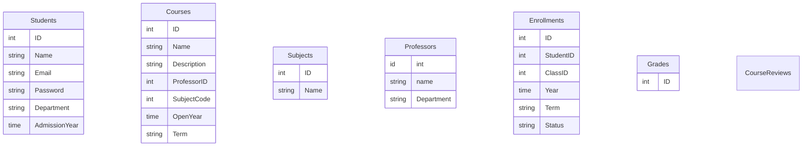

```mermaid
erDiagram
    %% 生徒テーブル
    Students {
        int ID
        string Name
        string Email
        string Password
        string Department
        time AdmissionYear
    }

    %% 授業テーブル
    Courses {
        int ID
        string Name
        string Description
        int ProfessorID
        int SubjectCode
        time OpenYear
        string Term
    }

    %% 科目テーブル
    Subjects {
        int ID
        string Name
    }

    %% 教授テーブル
    Professors {
        id int
        string name
        string Department
    }

    %% 履修テーブル
    Enrollments {
        int ID
        int StudentID
        int ClassID
        time Year
        string Term
        string Status

    }

    %% 評価テーブル
    Grades {
        int ID
    }

    %% 授業評価テーブル
    CourseReviews {
    }
```